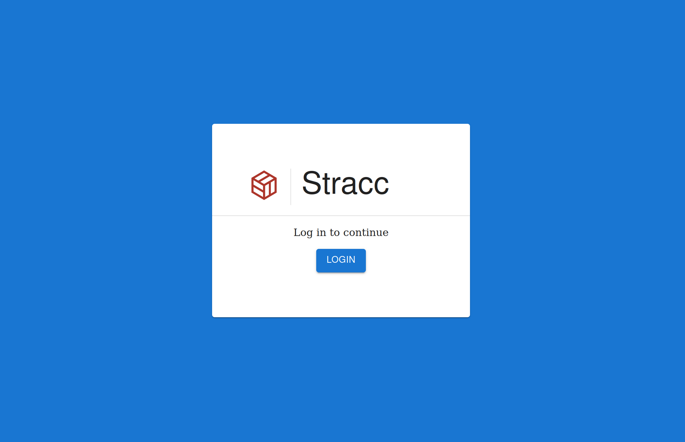
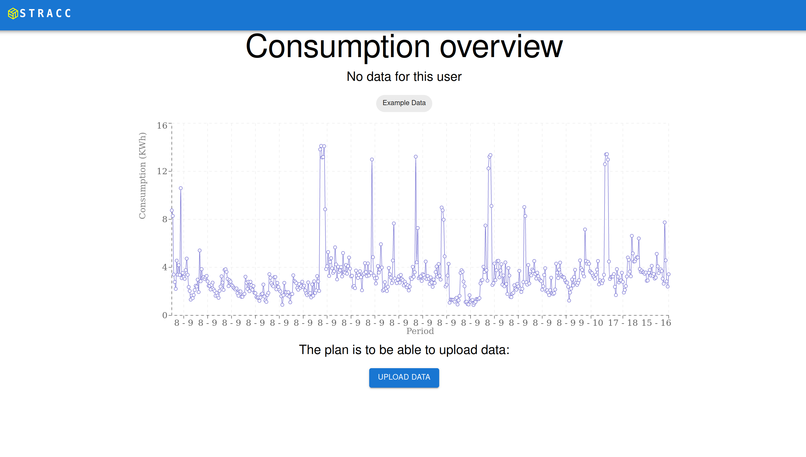

## Task description
This is my solution to the task given by Stacc. The task was to create solutions surrounding electricity consumption. I decided to create a web app that when finished should function as an electricity management platform with the following features:
- Login with Auth0
- View electricity consumption (can read from database, but not possible to upload data yet)
- Have an overview of different electricity providers (Read from the database

The following features are not yet implemented:

- Database for users and electricity consumption, including user roles (admin, user)
- Compare different electricity providers wrt. consumption
- Upload electricity consumption data

## Technologies used
My goal with this task was to challenge myself with technologies I haven't used before and/or don't fully understand. I chose to use the following technologies:
- Next.js (used this before, but not built a full app with it)
- Auth0
- Material UI
- Prisma orm
- Sqlite (for development, haven't set up a database for production) 

## How to run
Install dependencies with `yarn` and run the development server with `yarn dev`. The app will be available at `localhost:3000`.

## Comments
I chose to include the .env files in the repo, since I'm not using any sensitive data. I know this is not best practice, but I wanted to make it easier for you to run the app.
The app definitely isn't finished, but I'm happy with the progress I've made so far.
I also created a prisma schema that contains a potential database structure, even though the database isn't populated yet.

## Pictures
Login page

Home page

Electricity consumption page

Electricity providers page

